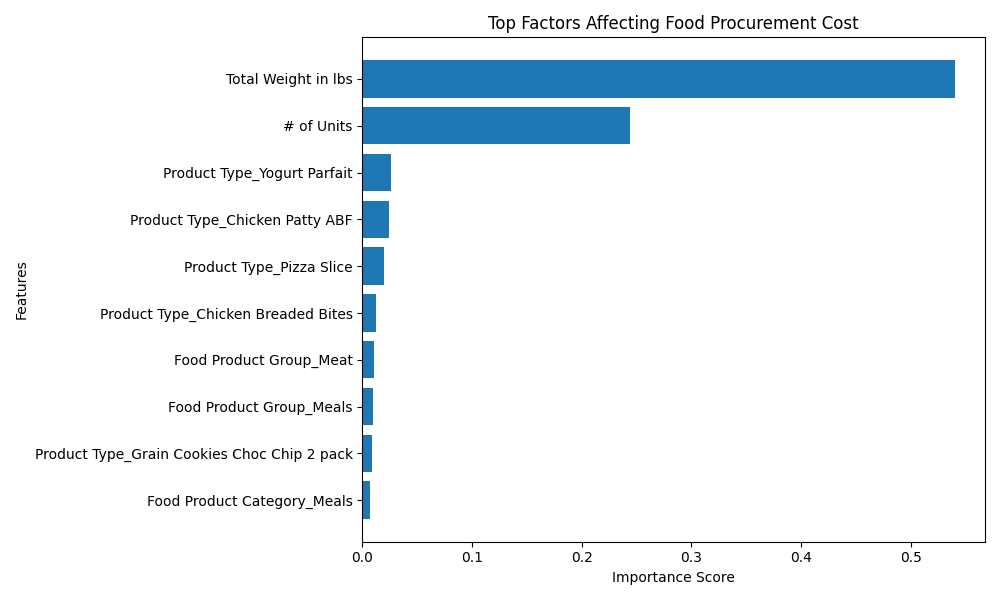

# Food Cost Prediction using Machine Learning

## Project Overview

This project predicts food procurement costs using Machine Learning techniques. The objective is to estimate procurement expenses based on transaction details such as units purchased, weight, vendor, distributor, agency, and product categories.

## Tools & Technologies

* Python
* Pandas
* NumPy
* Scikit-learn
* Random Forest Regressor
* Matplotlib
* Google Colab
* GitHub

## Dataset Information

* Total Records: 17,208
* Procurement transactions across multiple agencies
* Includes vendors, distributors, food categories, units purchased, weight, and total cost

## Problem Statement

Food procurement organizations need accurate cost estimation to support budgeting and purchasing decisions. This project uses historical procurement data to predict total procurement costs.

## Machine Learning Workflow

1. Data Loading and Exploration
2. Data Cleaning
3. Feature Selection
4. One-Hot Encoding of Categorical Variables
5. Train-Test Split
6. Random Forest Regression Model
7. Model Evaluation
8. Feature Importance Analysis

## Features Used

* Number of Units
* Total Weight in lbs
* Agency
* Vendor
* Distributor
* Food Product Group
* Food Product Category
* Product Type

## Target Variable

* Total Cost

## Model Used

* Random Forest Regressor

## Evaluation Metrics

* Mean Absolute Error (MAE)
* Mean Squared Error (MSE)
* R² Score

## Feature Importance

## Model Performance

The Random Forest Regression model achieved strong predictive performance:

* Mean Absolute Error (MAE): 41,046.93
* Mean Squared Error (MSE): 20,632,717,027.13
* R² Score: 0.812

The model explains approximately 81.2% of the variation in food procurement costs, indicating strong predictive capability.

### Key Findings

* Total Weight in lbs is the most influential factor affecting procurement cost.
* Number of Units purchased is the second most important predictor.
* Product type and food category contribute to cost variation but have significantly lower influence compared to volume-related variables.
* Procurement costs are primarily driven by purchase volume and product characteristics.

## Business Insights

* Larger purchase quantities and weights directly increase procurement costs.
* Procurement teams can use these insights for budgeting and demand forecasting.
* Understanding cost drivers helps optimize purchasing strategies and supplier negotiations.

The feature importance chart highlights the key factors influencing procurement costs.

## Business Impact

* Supports procurement budgeting
* Improves cost forecasting accuracy
* Identifies major cost drivers
* Enables data-driven purchasing decisions

## Repository Contents

* food_procurement_cleaned.csv
* analysis.ipynb
* feature_importance.png
* README.md

## Author

Sai Shashank R

MBA – Business Analytics
CMS Business School, Jain (Deemed-to-be University)
